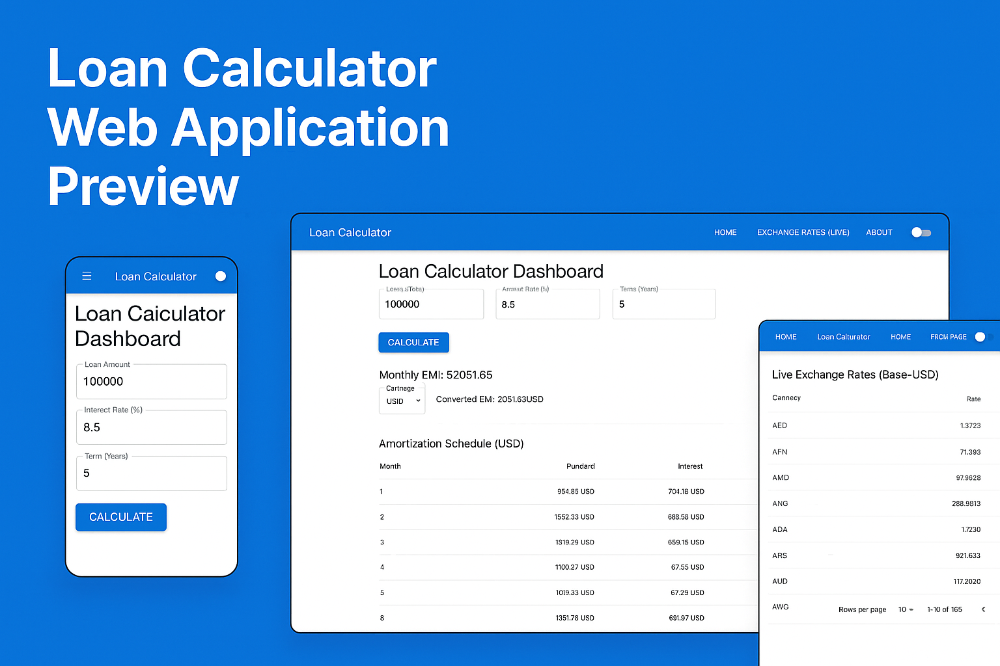
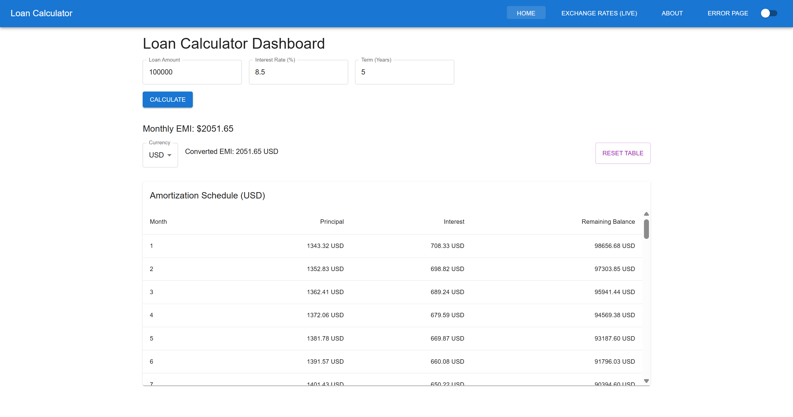
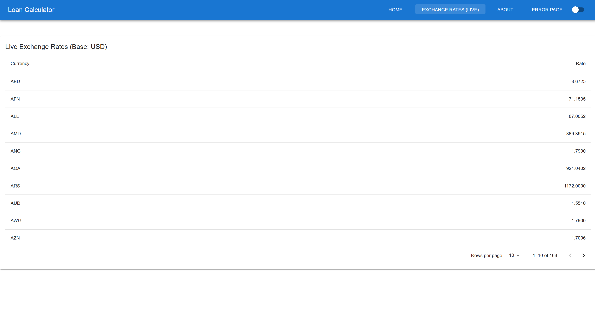
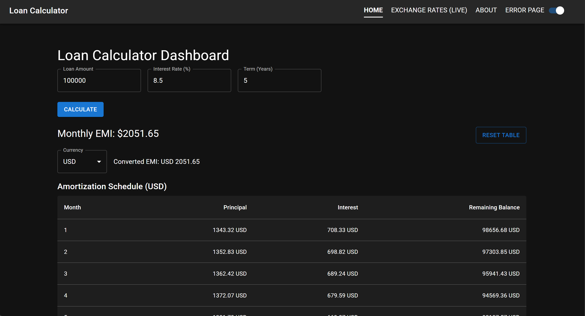
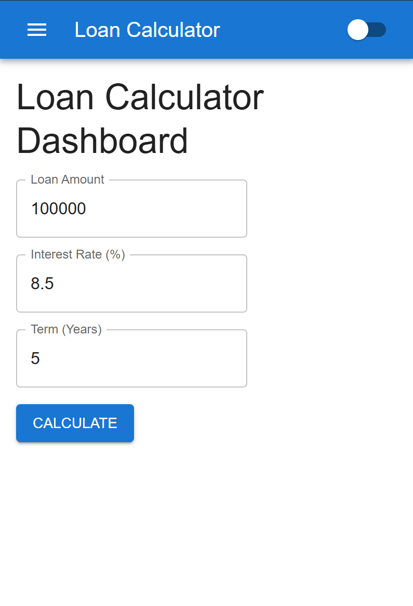

# Loan Calculator App

A modern, single-page web application built using React and Material UI. This app allows users to calculate loan EMIs (Equated Monthly Installments), view a detailed amortization schedule, and see real-time currency conversions of their EMI using live exchange rates.



## 🔧 Features

- **Loan EMI Calculation**: Calculate monthly payments using standard financial formulas
- **Amortization Schedule**: View a detailed monthly breakdown of your loan repayment
- **Currency Conversion**: Convert EMI to 160+ currencies using real-time exchange rates
- **Exchange Rates Table**: Browse current exchange rates with pagination support
- **Dark/Light Mode**: Toggle between dark and light themes for comfortable viewing
- **Responsive Design**: Optimized for all screen sizes with mobile-friendly navigation
- **Error Handling**: Dedicated error page and graceful API failure handling

## 📦 Technologies Used

- **Frontend**: React 19 with Hooks and Context API
- **Routing**: React Router v7
- **UI Framework**: Material UI v7
- **Styling**: CSS-in-JS with Emotion
- **API Integration**: Axios for HTTP requests
- **Build Tool**: Vite
- **Development**: ESLint for code quality

## 🔣 EMI Formula Used

The EMI (Equated Monthly Installment) is calculated using the standard formula:

```
EMI = [P × R × (1+R)^N] / [(1+R)^N – 1]
```

Where:
- P = Principal loan amount
- R = Monthly interest rate (annual rate / 12 / 100)
- N = Loan duration in months

## 🚀 Getting Started

### Prerequisites

- Node.js (v16 or higher)
- npm or yarn

### Installation

1. Clone the repository
   ```bash
   git clone https://github.com/YOUR_USERNAME/loan-calculator.git
   cd loan-calculator
   ```

2. Install dependencies
   ```bash
   npm install
   # or
   yarn install
   ```

3. Create a `.env` file in the root directory and add your Exchange Rate API key
   ```
   VITE_EXCHANGE_RATE_API_KEY=your_api_key_here
   ```

   > Note: You can get a free API key from [ExchangeRate-API](https://www.exchangerate-api.com/)

4. Start the development server
   ```bash
   npm run dev
   # or
   yarn dev
   ```

5. Open your browser and navigate to `http://localhost:5173`

## 📋 Project Structure

```
loan-calculator/
├── public/              # Static files
├── src/
│   ├── components/      # Reusable UI components
│   ├── context/         # Context providers for global state
│   ├── hooks/           # Custom React hooks
│   ├── pages/           # Main application pages
│   ├── App.jsx          # Main application component
│   ├── main.jsx         # Entry point
│   └── index.css        # Global styles
├── .env                 # Environment variables (create this file)
├── package.json         # Dependencies and scripts
└── vite.config.js       # Vite configuration
```

## 📱 Pages

- **Home**: Main loan calculator with EMI calculation and amortization schedule
- **Exchange Rates**: Table of current exchange rates with pagination
- **About**: Information about the application and its features
- **Error Page**: Custom 404 page for handling navigation errors

## 🌍 Currency Conversion API

This app integrates with the [ExchangeRate-API](https://www.exchangerate-api.com/) to fetch live exchange rates. The free tier allows up to 1,500 API calls per month.

## 🔄 Context Providers

- **ThemeContext**: Manages dark/light mode preferences
- **CurrencyContext**: Handles currency conversion and exchange rate data

## 🧰 Custom Hooks

- **useEmiCalculator**: Manages loan calculation logic and amortization schedule generation

## 📷 Screenshots

### Home Page


### Exchange Rates


### Dark Mode


### Mobile View


## 🙏 Acknowledgements

- [Material UI](https://mui.com/) for the component library
- [ExchangeRate-API](https://www.exchangerate-api.com/) for currency conversion data
- [React Router](https://reactrouter.com/) for navigation
- [Vite](https://vitejs.dev/) for the build tooling
